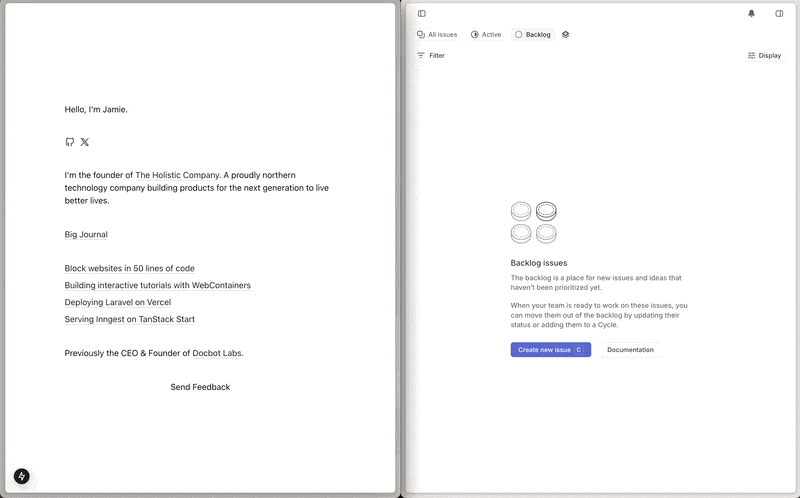

# Quadratic V2

Easily capture user feedback in your app and track it in Linear. Created by [The Holistic Company](https://www.holistic.company).



## Getting Started

```bash
npm install quadratic-v2
yarn add quadratic-v2
pnpm add quadratic-v2
bun add quadratic-v2
```

### Handler Setup

#### NextJS

```ts
// app/api/feedback/route.ts

import { createHandler } from "quadratic-v2/server";

export const POST = createHandler({
  apiKey: process.env.LINEAR_API_KEY!,
  teamId: process.env.LINEAR_TEAM_ID!,
});
```

### Feedback Component

#### React

```tsx
// app/page.tsx

import "quadratic-v2/style.css";
import { FeedbackWidget } from "quadratic-v2/react";

export default function Home() {
  return (
    <FeedbackWidget>
      <button>Feedback</button>
    </FeedbackWidget>
  );
}
```